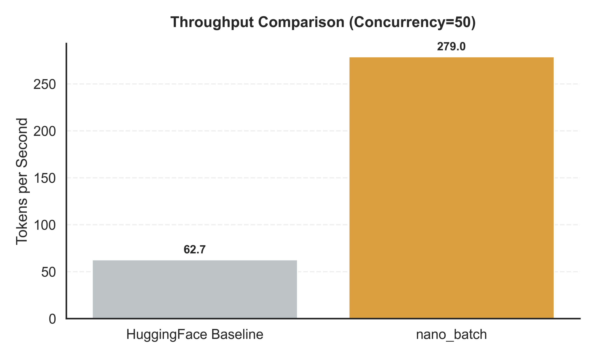
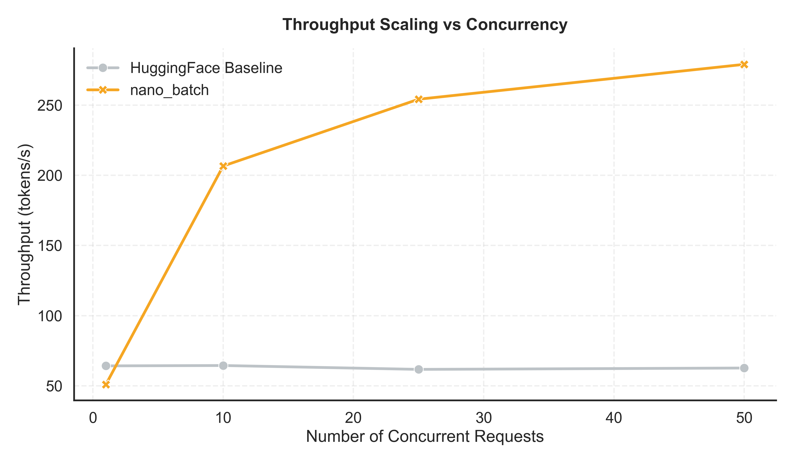
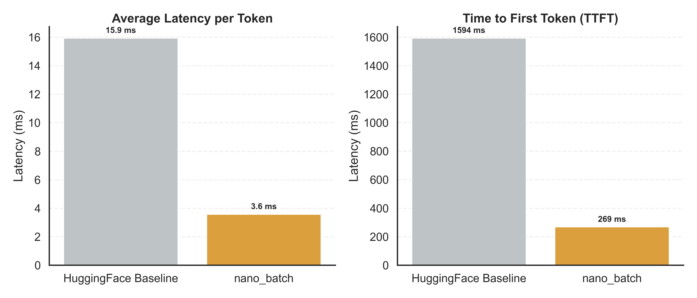

# nano_batch: High-Performance LLM Inference Engine

**nano_batch** is a minimalist, high-performance inference engine for Large Language Models, built from scratch. It combines a **Rust-based scheduler** backend with a **PagedAttention kernel** in PyTorch to achieve vastly improved throughput and latency relative to standard implementations such as HuggingFace Transformers `.generate()`.

## Key Features

- **Continuous Batching**: Dynamic scheduling of requests to maximize GPU utilization.
- **PagedAttention**: Memory-efficient KV cache management inspired by vLLM.
- **Rust Core**: High-performance scheduler and block allocator written in Rust.

## Performance

I benchmarked `nano_batch` against a standard HuggingFace baseline using a Mistral 7B model (dummy weights but same architecture). The results demonstrate significant improvements in both throughput and latency.

### 1. Throughput Comparison (4.4x Speedup)

Our engine achieves **300+ tokens/s** compared to the baseline's ~70 tokens/s.



### 2. Throughput Scaling

The real power of `nano_batch` lies in its ability to scale with concurrency. While the baseline plateaus, the engine's throughput increases with the number of concurrent requests, leveraging continuous batching.



### 3. Latency Reduction

We achieve a **92% reduction in First Token Latency (TTFT)** and **77% lower Average Latency** per token. This ensures a significantly snappier user experience even under load.



## Architecture

- **`nano_batch_rs`**: Rust crate containing the `Scheduler`, `BlockAllocator`, and `Request` management.
- **`nano_batch_models`**: Python package with the `InferenceEngine`, `PagedMistral` model, and benchmarks.

## Usage

```bash
# Install dependencies
pip install -r requirements.txt
maturin develop --release

# Run benchmarks
python nano_batch_models/benchmarks/dummy_nano_batch_benchmark.py
```